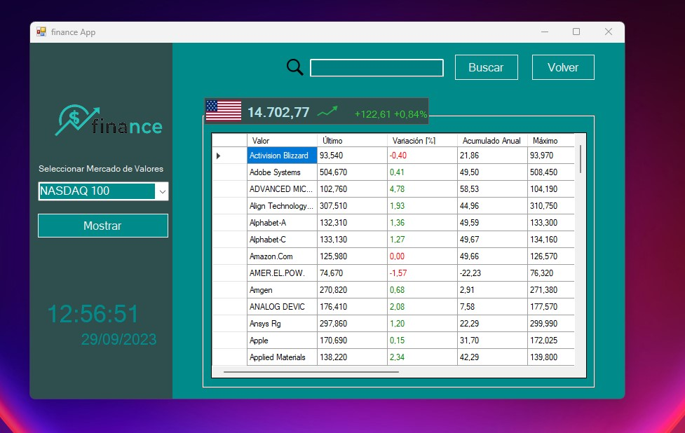

## Finance App

Desktop application which permits the user to checkout how different stock markets around the world are evolving in real time.

> Note: Personal project to put in practice web scrapping techniques using Microsoft Visual Studio C#

<p align="center">
  <picture>
    <source media="(prefers-color-scheme: dark)" srcset="./documentation_images/Stock_market2.jpg">
    
  </picture>
</p>

# Description

Once the desktop application has been executed, the program will show a first empty window. The stock markets 
can be then selected on a scroll menu located in the left side of the application.

Being the possible stock market options:

- [IBEX35](https://en.wikipedia.org/wiki/IBEX_35)
- [EUROSTOXX 50](https://en.wikipedia.org/wiki/EURO_STOXX_50)
- [DAX 30](https://en.wikipedia.org/wiki/DAX)
- [DOW JONES 30](https://en.wikipedia.org/wiki/Dow_Jones_Industrial_Average)
- [NASDAQ 100](https://en.wikipedia.org/wiki/Nasdaq)
- [CAC 40](https://en.wikipedia.org/wiki/CAC_40)
- [FTSE 100](https://en.wikipedia.org/wiki/FTSE_100_Index)
- [EURONEXT 100](https://en.wikipedia.org/wiki/Euronext_100)

And the values for each one:

- Valor (Value): Company name 
- Último (Last): Price associated to the last closed trading session
- Variación (Variation) [%]: Variation of an asset to its previous price
- Acumulado Anual (Annual cumulative): Cumulative change of a price respect last year
- Máximo (Max. stock price): Highest price for the actual trading session
- Mínimo (Mín. stock price): Lowest price for the actual trading session
- Volumen (Volume): Number of shares or contracts, measures the level of liquidity
- Capitalización (Market cap.): Value of the company
- Hora (Last update): Last time update

Also it is possible to filter a company name by using the searching tool above and return back to the main table.

<p align="center">
  <picture>
    <source media="(prefers-color-scheme: dark)" srcset="./documentation_images/Search.jpg">
    
  </picture>
</p>

# Libraries

This project has been developed by using the ```HtmlAgilityPack``` to scrap data from a [source](https://www.expansion.com/mercados.html) website

