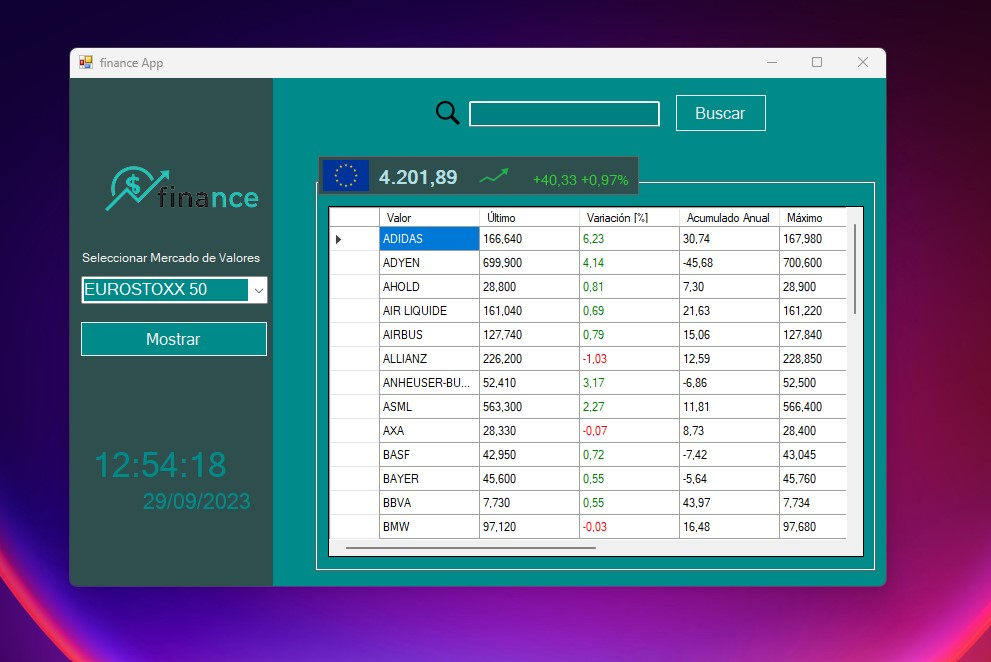

## Finance App

Desktop application which permits the user to checkout different stock markets around the world are evolving in real time.

> Note: Personal project to put in practice web scrapping techniques in Microsoft Visual Studio C#

<p align="center">
  <picture>
    <source media="(prefers-color-scheme: dark)" srcset="./documentation_images/Start.jpg">
    
  </picture>
</p>

# Description

Once the desktop application has been executed, the program will show a first empty window. The stock markets 
can be selected on scroll menu in the left side of the application.

Being the possible options:

- (IBEX35)[https://en.wikipedia.org/wiki/IBEX_35]
- (EUROSTOXX 50)[https://en.wikipedia.org/wiki/EURO_STOXX_50]
- (DAX 30)[https://en.wikipedia.org/wiki/DAX]
- (DOW JONES 30)[https://en.wikipedia.org/wiki/Dow_Jones_Industrial_Average]
- (NASDAQ 100)[https://en.wikipedia.org/wiki/Nasdaq]
- (CAC 40)[https://en.wikipedia.org/wiki/CAC_40]
- (FTSE 100)[https://en.wikipedia.org/wiki/FTSE_100_Index]
- (EURONEXT 100)[https://en.wikipedia.org/wiki/Euronext_100]


Also it is possible to filter a company name by uusing the search tool above

<p align="center">
  <picture>
    <source media="(prefers-color-scheme: dark)" srcset="./documentation_images/Search.jpg">
    
  </picture>
</p>

# Libraries

This project has been mainly developed by using the ```HtmlAgilityPack``` to scrap from the (data source)[https://www.expansion.com/mercados.html] website

